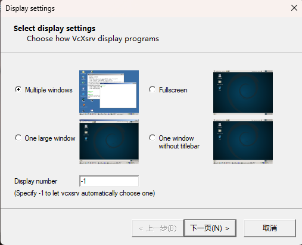
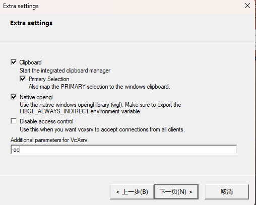

# FilesBackup

## 通过docker运行

docker构建
```shell
git clone https://github.com/skyfishine/FilesBackup

docker build . --no-cache -t files_backup:1.0

docker run -dit -e DISPLAY=host.docker.internal:0 -e LANG=zh_CN.UTF-8 -e LC_ALL=zh_CN.UTF-8 --name files_backup files_backup:1.0 /bin/bash
```

编译运行：
```shell
cd build
cmake .. && make -j && make install
./backup
```

## 说明

本项目在docker中指定了环境变量`DISPLAY=host.docker.internal:0`，所以可以在宿主机中运行Xming服务器，例如XLaunch，从而显示docker的图形界面

例如可以按照如下方式配置图形界面：
1. 在宿主机（windows）上安装[VcXsrv](https://vcxsrv.com/)
2. 运行该软件
  - 可以选择`multiple window`，这样打开一个图形界面，就有一个独立的小窗口
  - 也可以试试其他展示方式



3. 一直下一步，在图示步骤下填写参数`-ac`，禁用访问控制，允许来自任何主机的X连接



4. 最后不断下一步，完成即可。

## 功能展示

参见PPT

## 项目扩展方向

如果你想要以此项目为基础继续扩展，可以考虑以下方向：

1. 实时备份
2. 网络备份（可以考虑将BackupServer中的接口改造为网络接口，使用http或rpc？）
3. 对输入的内容进行正则校验；备份恢复时文件夹重名的提示；备份进度的显示...

> 但是，个人觉得自己写的就是一坨，不建议扩展。

## 答辩说明

*ps. lxy的课*

1. 会对你的程序进行健壮性的考察（例如看你能否支持大文件的打包例如>2G，是否支持空文件打包/空文件是否进行提示，主要看助教怎么考）
2. 要向老师展示你的项目管理工具，例如pingcode、git、docker、cmake...（git需要有commit记录）
3. 也要展示你的单元测试，如gtest